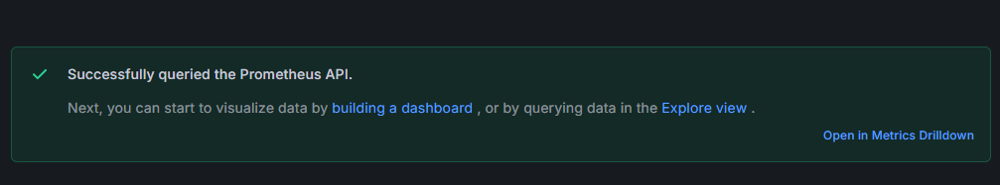

# Monitoring using Promethues and Grafana

- Prometheus is open-source Monitoring and alerting Tool.
- It collects and store real time series data (metrics) from application,servers and databases.
- It works on Pull Models, Scraps metrics from application and expose endpoints

- Its having Its own query Language which is PromQl
- it also sends alert via alert manager.

- We can manually also donwload from
[Download Prometheus](https://prometheus.io/download/)

- you can edit prometheus.yml file as per your requirements 
- run application it will start on port 9090
- loclahost:9090 (prometheus Dashboard)

# To Start Promethues using Docker Image

- To combine prometheus with Grafana and Python app 
- create folder and under that create files

    - docker-compose.yml (main file to run all services)
    - prometheus.yml (config file for prometheus)
    - app.py (code for python app)
    - requirements.txt (dependency for Python app)
    - Dockerfile (Python-app Image)

```bash
# open above folder location in cmd or terminal
docker compose up -d --build
docker ps
docker logs
# If all good then access 

```
http://localhost:9090/targets (check prometheus targets)
http://localhost:3000 (grafana dashboard) - access admin/admin
http://localhost:5000 (Python App)

- to check metrics of python app
http://localhost:5000/metrics 
- (in this you can see req count which is increase as you refresh python app)

## Query prometheus

- in its query tab type: http_requests_total
- click on execute: see the request count, you can also check graph
- also try to refresh localhost:5000 to increase count

- to send continue req per second run below command

```bash
while true; do curl -s http://localhost:5000> /dev/null; sleep 1; done
```
- check prometheus query response as well

## Grafana

- Grafana is open source visualization and dashboard tool
- it is not collecting data by itself but connects with data source like Prometheus, MySQL, CloudWatch, Elastic Search...
- Build interactive Dashboards from collected data
- provides alerts, graphs and visualization of data

- http://loclahost:3000 (dashboard)
- Credentials: Username: admin, password: admin
- if you don't want to change password you can skip

**Let's Configure Prometheus to Grafana**

- click on connection - data source
- add new data source
- select Prometheus
- Give Name: Prometheus, in connection URL: http://prometheus:9090
- scroll down lastly click on save + test


**Creating Dashboard**

- click on dashboard --> create new dashboard
- add visualization --> select prometheus as datasource
- add query: http_requests_total
- execute and check graph its getting data from prometheus
- to increase more trafic: 
```bash   
sudo apt install apache2-utils
ab -n 3000 -c 100 http://localhost:5000/ 

# send per second 100 request for 30 seconds
```
- Check Graph is Grafana 

## Queries in Grafana

1. Check Which API is most used

    - query: sum by (endpoint) (http_requests_total)
    - set visualization: bar chart
    - best for comparing end points

2. See traffic Trend

    - query: rate(http_requests_total[1m])
    - set visualization: Time Series (Line Graph)
    - best for CPU, req count latency over time

3. Shows GET vs POST vs Put request

    - query: sum by (method) (http_requests_total)
    - set visualization: Pie Chart
    - percentage breakdown

4. Stat panel

    - query: sum(rate(http_requests_total[1m]))
    - set visualization: Stat
    - NOC dashboard

5. Gauage

    - query: process_resident_memory_bytes
    - set visualization: Guage
    - set min: 0, max: 500Mb
    - shows you memory Usage

*You can create multiple panels in one dashboard*
*In One Panel you can add Multiple Queries*

- Go to your dashboard panel
- edit
- alern -> create Alert rule
- Name: High Request Rate
- scroll down - give folder name (if not create)
- evaluation name (if not create)
- set thresold: like query name, above 100
- contact point set : default email

*Save this rule and again increase traffic*

```bash   
ab -n 3000 -c 100 http://localhost:5000/ 
```

*You can see alarm is firing*


