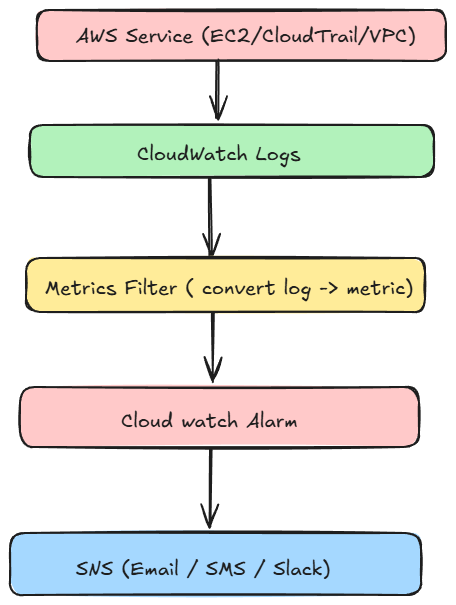
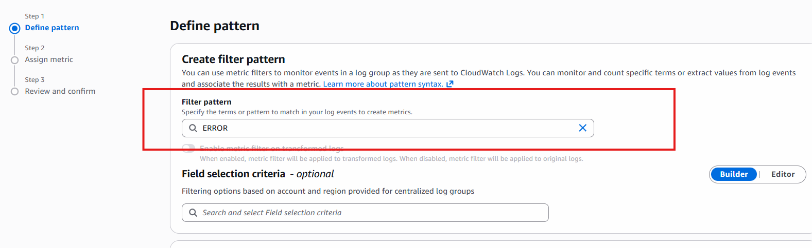
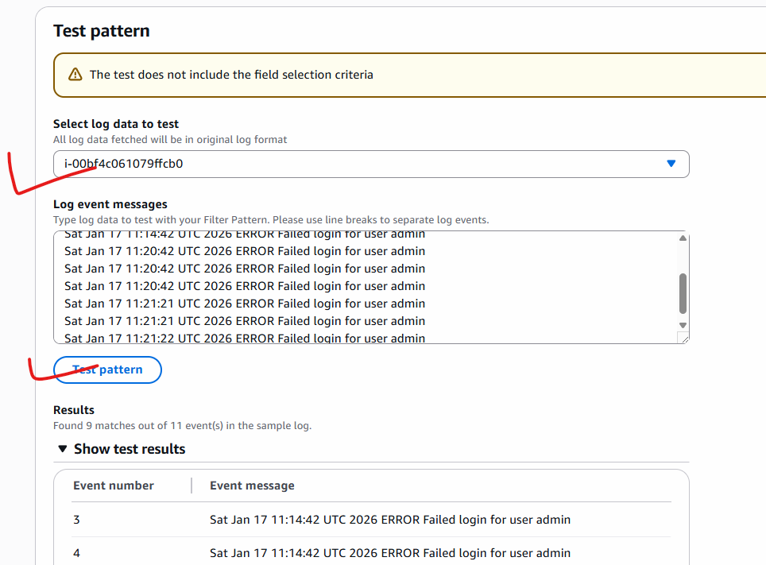
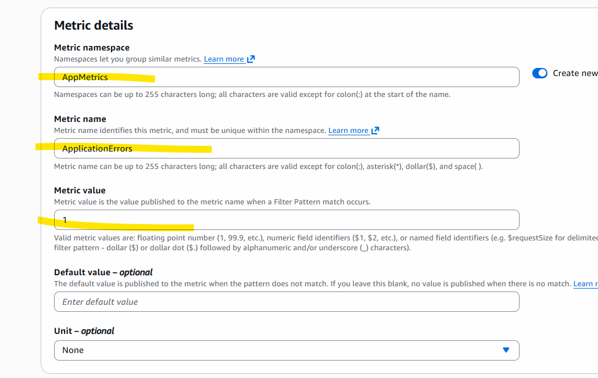
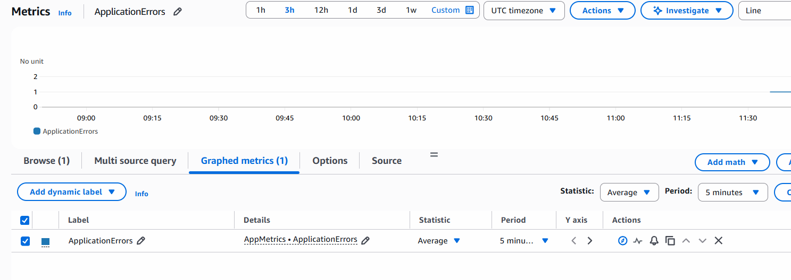
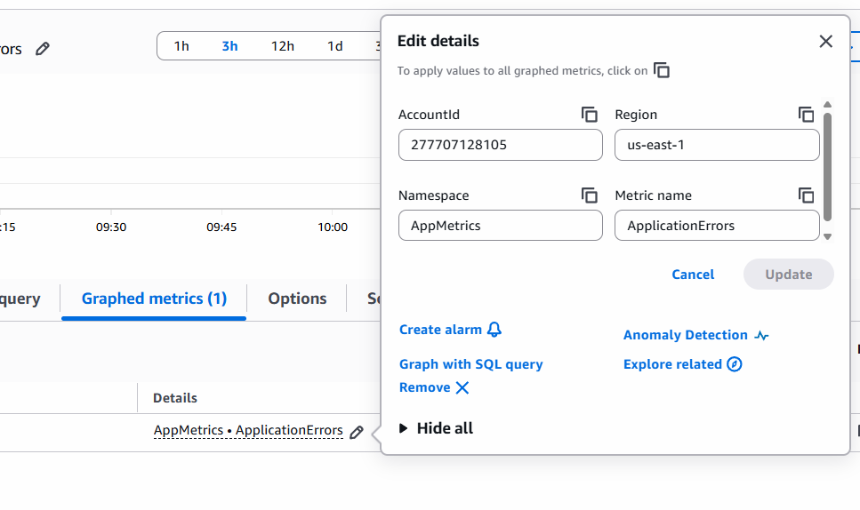
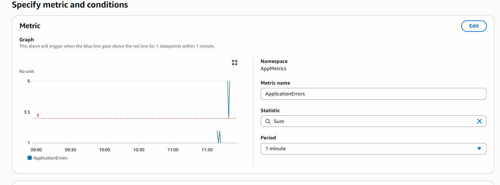
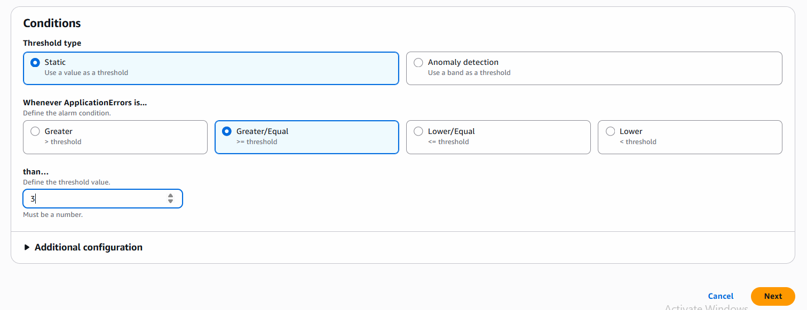
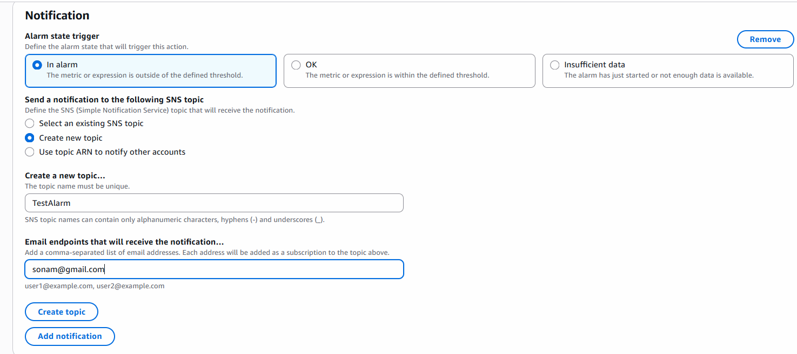
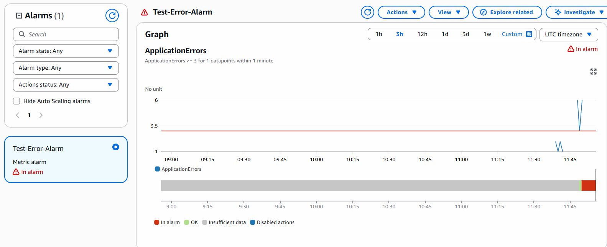

# Cloudwatch Alarms

- Aws gives us logs, but logs alone useless unless you monitor them, detect issue and alert.

**Example for Activities can cause problems**

- Multiple Failed SSh login attemps
- Unauthorized API calls
- Root User login
- Sudden spike in 4xx/5xx erros
- Ec2 instance stopped unexpectedly
- IAM permissions denied errors.



## Let's Implement

1. create Role IAM 
    - IAM -> Roles -> Create Role
    - Service EC2
    - Attach CloudWatch Policy
    - CloudWatchAgentServerPolicy
    - Create Role

2. Create EC2 Linux Instance
    - Attach Above Created Role to instance
    - Connect with instance using SSH

```bash
sudo yum install amazon-cloudwatch-agent -y

sudo mkdir /var/log/myapp
sudo touch /var/log/myapp/app.log

echo "Hello Cloud Watch Logs Demo" | sudo tee -a /var/log/myapp/app.log
cat /var/log/myapp/app.log # verify Logs

sudo nano /opt/aws/amazon-cloudwatch-agent/etc/amazon-cloudwatch-agent.json
# edit using below code
```

**amazon-cloudwatch-agent.json**

```json
{
  "logs": {
    "logs_collected": {
      "files": {
        "collect_list": [
          {
            "file_path": "/var/log/myapp/app.log",
            "log_group_name": "/demo/ec2/myapp",
            "log_stream_name": "{instance_id}"
          }
        ]
      }
    }
  }
}
```

- verify JSON using Below Command

```bash
python3 -m json.tool /opt/aws/amazon-cloudwatch-agent/etc/amazon-cloudwatch-agent.json

sudo /opt/aws/amazon-cloudwatch-agent/bin/amazon-cloudwatch-agent-ctl \
-a start \
-c file:/opt/aws/amazon-cloudwatch-agent/etc/amazon-cloudwatch-agent.json \
-m ec2

# check status
amazon-cloudwatch-agent-ctl -a status
# generate Fresh logs
echo "FINAL SUCCESS TEST $(date)" | sudo tee -a /var/log/myapp/app.log

```

### Check logs in Cloud Watch

- Clouwatch --> Log Management 
- Log Group
- Check Logs

```bash
for i in {1..3}; do
  echo "$(date) ERROR Failed login for user admin" | sudo tee -a /var/log/myapp/app.log
done
```
- Generate Error Logs

- Check again in CLoudwatch

### Let's Create Filter

- Cloud Watch --> Log Management --> /demo/ec2/myapp 
- Click on metric filter Tab -> Create Metric Filter





- click on next and update metrics details

- Metric Value is 1 -> metric count increase by 1 on each Error Log



- click on next and then save changes

- Check Metric Details



- create Alarm by clicking on App Metrics



- Alarm Edit Details



- Create SNS topic for Notification


- create topic, go to email and confirm subscription



- Create Alarm

- Again go to terminal send Error Logs

```bash
for i in {1..5}; do
  echo "$(date) ERROR Failed login for user admin" | sudo tee -a /var/log/myapp/app.log
done
```

- After 1 minutes
- you can see In Alarm status, mail received based on log filter

