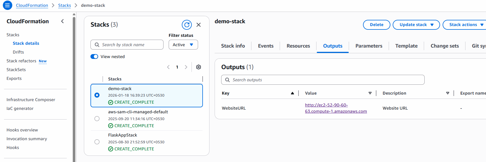

# CloudFormation

- its is helping us to create Infra just like Terraform

- create folder cloudformationstack
- under that create file ec2_demo.yml

[Reference Code](https://docs.aws.amazon.com/AWSCloudFormation/latest/UserGuide/gettingstarted.walkthrough.html)

- Run use below command

```bash
aws cloudformation create-stack --stack-name demo-stack --template-body file://ec2_demo.yml
# Another way
aws cloudformation create-stack --stack-name demo-stack --template-file ec2_demo.yml
```

- result your can see stackid & operation id

- now goto aws console
- cloud formation --> check all stack
- click on stack-demo

- check output tab



- you can click on link and see Hello World in browser

```bash
# Delete Stack
aws cloudformation delete-stack --stack-name demo-stack
```

## in case of failing state change instance-type t3.micro