# ECS cluster with Task Defination, launch Service amd Access App

1. Create ECS Cluster

    - AWS Console - ECS
    - Create Cluster: esc-demo-cluster
    - Infra: AWS Fargate
    - Keep all default
    - Create Cluster

2. Task Defination: Blueprint for your container (image, CPU, memory, ports)

    - below clusters see task defination option
    - click on the same
    - Create New Task Defination
    - family name: frontend
    - OS: Linux
    - CPU: .25 vCPU
    - Memory: 0.5 GB
    - Task Role: None
    - Task Execution Role: ecsTaskExecutionRole
        -  (Create a Role: Service: Elastic Container Service --> Task Executirole Fole Elastic Container Service --> next --> ecsTaskExecutionRole )
        - Select This Role Here
    - Containers

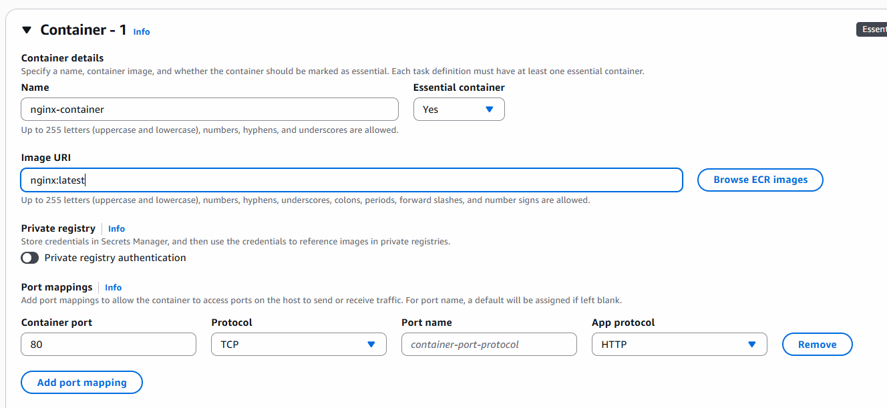

    - Keep other options as default
    - Create Task Defination

3. Create Target Groups

    - EC2 - Target Groups
    - Choose IP

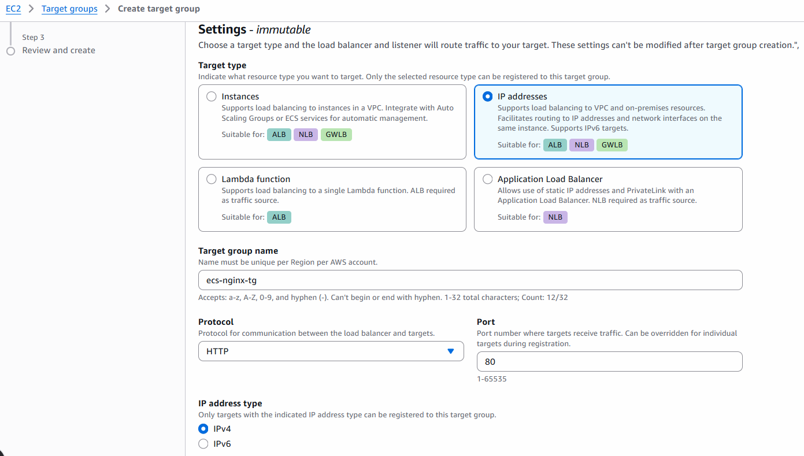
    - others keep as default and create

4. Create Load Balancer

    - EC2- Application Load Balancer

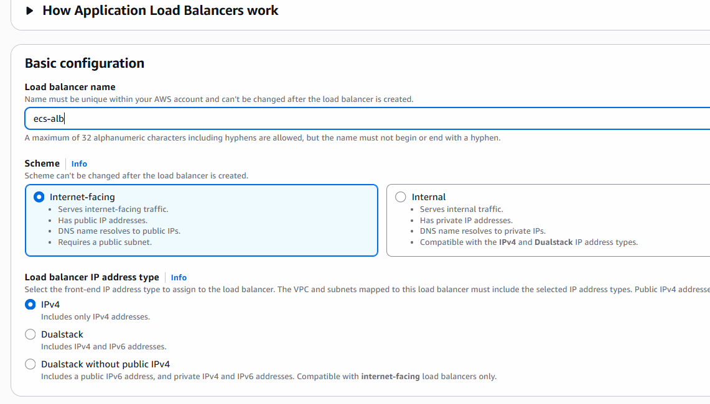
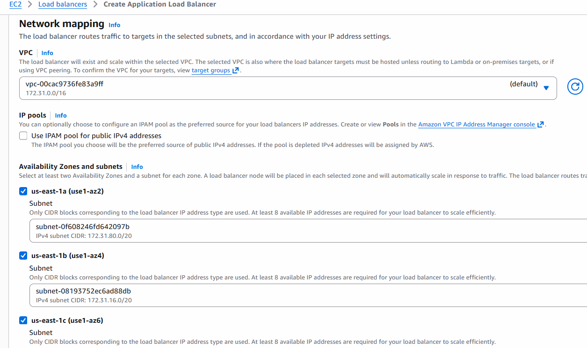

    - choose all availability zone (subnets)
    - Config Security Group and target Group

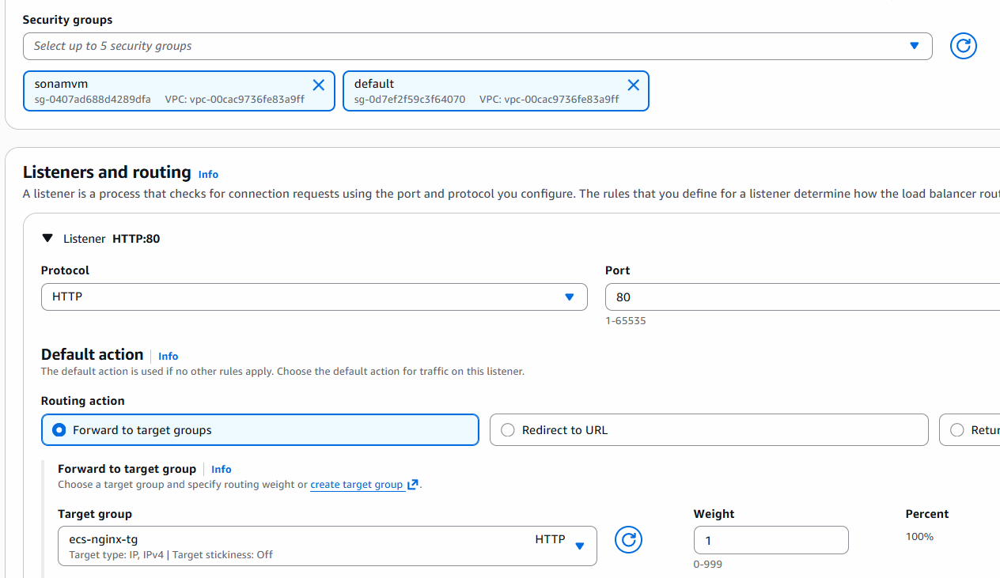
    
    - Create Load Balancer

5. Create ECS Service

    - Go to ECS Cluster
    - see create service

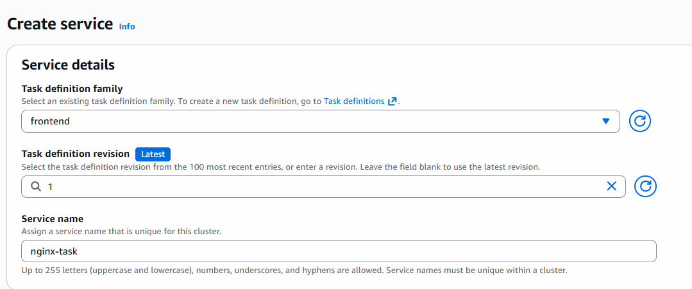

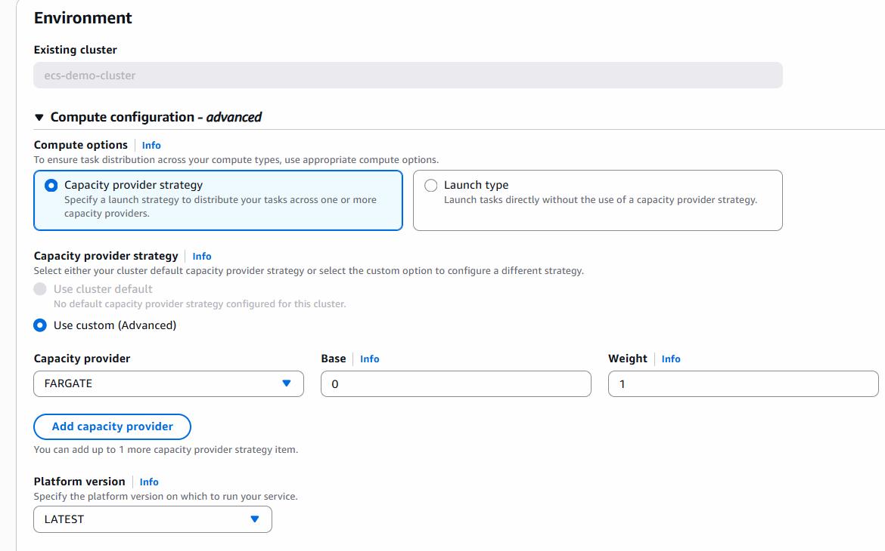

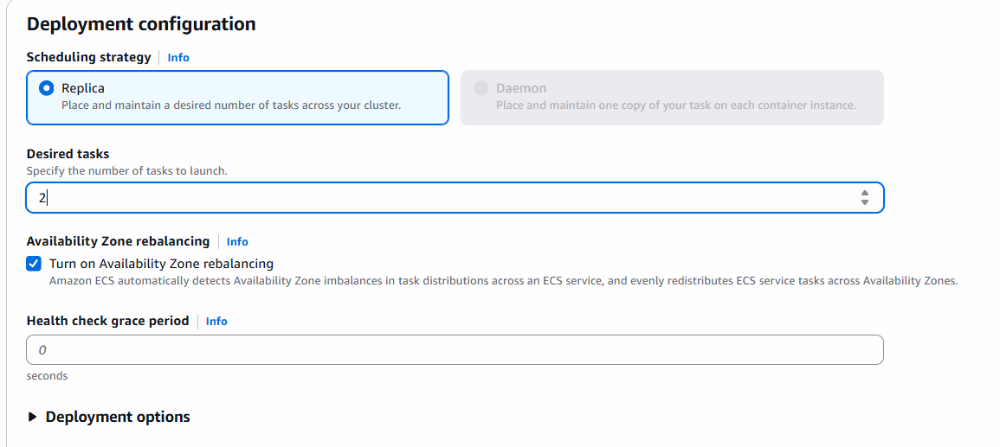

    - expand and enable Load Balancing

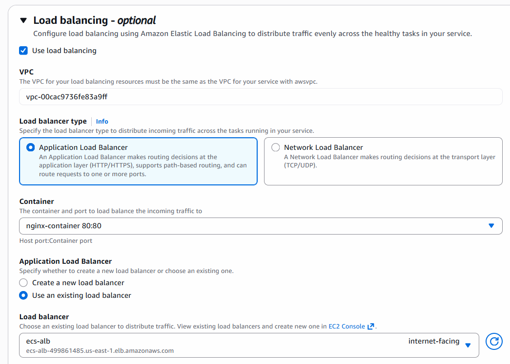

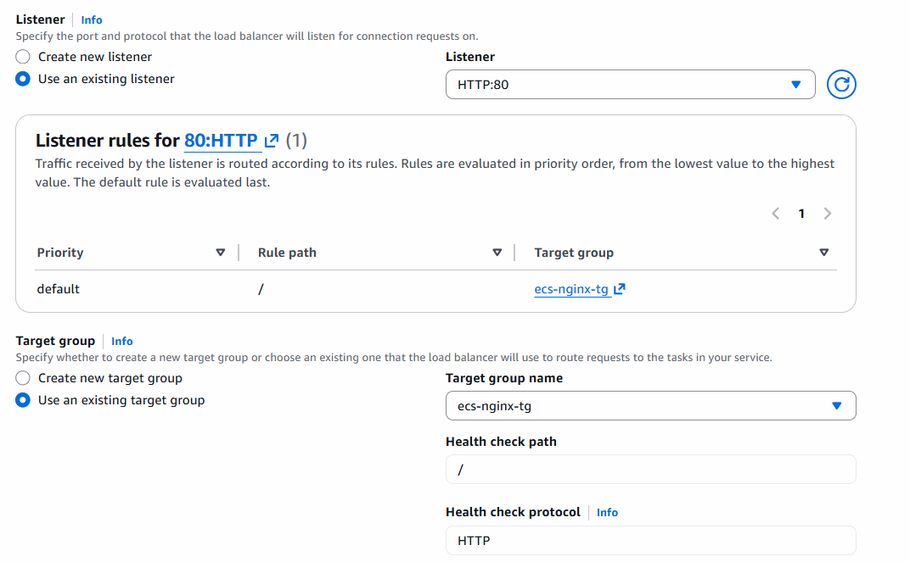

-  Create Service

- Check the events in service

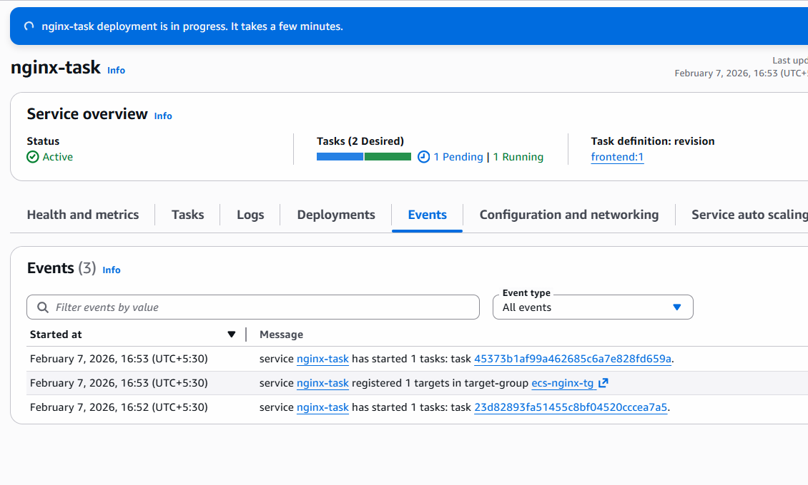

- Check LoadBalancer DNS by accessing in Browser , you can see default page of nginx
- Open target Groups and Ses registered Containers by checking Health

## What is Happening Here?

- ECS launch Fargate Service
- Assign ENI + private IP
- Register Task into IP
    - adding under target Group
- perform Health Check
- Deregister on scale-in

## After Practice Make Sure to clear all your resources

    - delete Service
    - Delete Cluster
    - de-register Task Defination frst
    - filter with inactive
    - delete Task Defination
    - Delete Load Balancer
    - Delete Target Groups